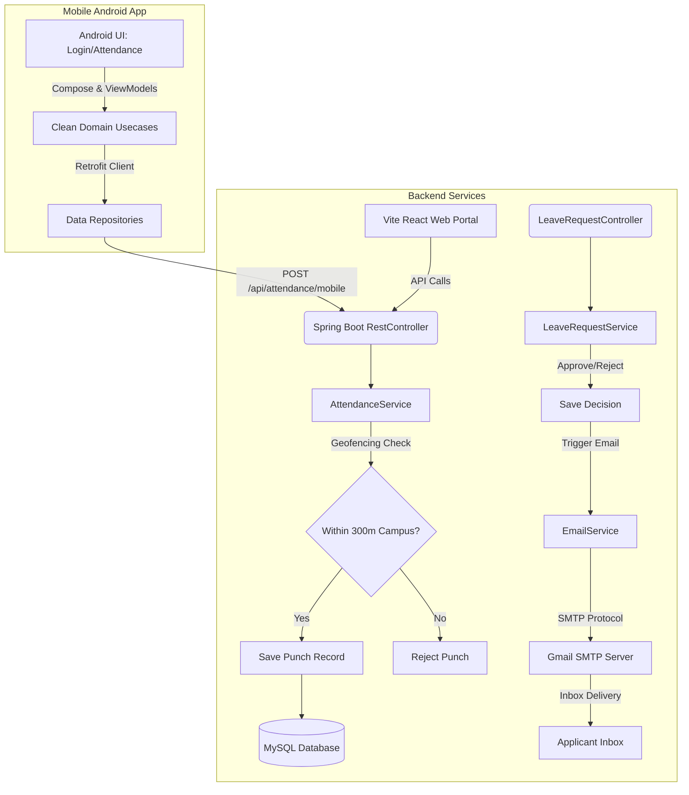

# Admin Office Management System

A production-style full-stack web application simulated for institutional administrative office operations in colleges or IITs. It features role-based access control, student and faculty registries, official bulletin board notices, a student leave application workflow (with document upload), an issue ticket/complaint tracker, and analytical reports (with PDF/CSV export).

---

## Technical Stack

*   **Backend**: Java Spring Boot 3.2.5, Spring Security 6.x, Spring Data JPA, JWT Authentication (jjwt 0.11.5), Maven, OpenPDF.
*   **Frontend**: React.js (Vite), Tailwind CSS v3, Axios, React Router DOM, Lucide Icons, Recharts.
*   **Database**: MySQL 8.x.

---

## System Architecture



---

## Folder Structure

```text
IIT/
├── android/            # Jetpack Compose native Android application module
│   ├── app/            # Source code, themes, layouts, viewmodels, and DI modules
│   └── build.gradle.kts# Android app gradle scripts
├── backend/            # Java Spring Boot backend project
│   ├── src/            # Java source files and configurations
│   └── pom.xml         # Maven project dependencies file
├── frontend/           # React.js Vite frontend web application
│   ├── src/            # Components, pages, context, and styles
│   └── package.json    # Frontend dependency mappings
├── sql/                # Database definition scripts
│   ├── schema.sql      # Tables, indexes, stored procedures, and triggers
│   └── seed_data.sql   # BCrypt-hashed mock data seed file
├── postman/            # Postman integration collections
│   └── IIT_Admin_Office_System.postman_collection.json
└── README.md           # Project setup and user guide
```

---

## Database Setup

1.  Start your MySQL service.
2.  Open your preferred MySQL client (command line, WorkBench, DBeaver, etc.) and log in:
    ```bash
    mysql -u root -p
    ```
3.  Import the database schema:
    ```sql
    source sql/schema.sql;
    ```
4.  Seed the initial dummy data:
    ```sql
    source sql/seed_data.sql;
    ```

*Note: The database name will be initialized as `iit_admin_db`. The seed data populates tables with default admin, staff, faculty, and student profiles.*

---

## Backend Configuration & Start

1.  Verify the database credentials in `backend/src/main/resources/application.properties`:
    ```properties
    spring.datasource.url=jdbc:mysql://localhost:3306/iit_admin_db?useSSL=false&serverTimezone=UTC&allowPublicKeyRetrieval=true
    spring.datasource.username=root
    spring.datasource.password=password
    ```
2.  Navigate to the `backend/` directory:
    ```bash
    cd backend
    ```
3.  Start the Spring Boot application using Maven:
    ```bash
    mvn clean spring-boot:run
    ```


The backend server will run at: **`http://localhost:8080`**.

---

## Frontend Configuration & Start

1.  Navigate to the `frontend/` directory:
    ```bash
    cd frontend
    ```
2.  Install dependencies:
    ```bash
    npm install
    ```
3.  Run the Vite development server:
    ```bash
    npm run dev
    ```

The frontend application will be hosted at: **`http://localhost:5173`**.

---

## User Roles & Credentials

All seeded accounts share the default password: **`password`** (BCrypt-hashed).

| Role | Username | Email | Permission Scope |
| :--- | :--- | :--- | :--- |
| **ADMIN** | `admin` | `admin@iit.ac.in` | Full management access: Student, Faculty, Notice, Leaves, Complaints. |
| **STAFF** | `staff_rahul` | `rahul.staff@iit.ac.in` | Manage student registry, process leave requests, assign/close complaints. |
| **FACULTY** | `prof_sharma` | `dsharma@cse.iit.ac.in` | Create/delete notices, view faculty list, apply for leave. |
| **STUDENT** | `stud_amit` | `amit.singh@iit.ac.in` | View notices, apply for leave (upload docs), raise complaint tickets. |

---

## Stored Procedures & Triggers Included

*   **`GetDepartmentStudentCount()`**: Summarizes students count by academic department.
*   **`GetMonthlyLeaveStats()`**: Computes approval and rejection metrics per calendar month.
*   **`GetComplaintCategoryStats()`**: Grouping complaint tickets by operational category with resolution percentage.
*   **`GetStudentRegistrationOrder()`**: Demonstrates analytical window functions (`ROW_NUMBER()`) partitioning registration order inside departments.
*   **`after_notice_insert`**: Database trigger logging system activities on notice updates.
*   **`after_complaint_insert`**: Database trigger creating audit logs on ticket creations.

---

## API Testing (Postman)

Import the file: `postman/IIT_Admin_Office_System.postman_collection.json` into Postman.
*   The collection includes tests that automatically capture the JWT token upon calling **User Login** and load it into global headers for all other requests.
*   Configure the postman environment variables `base_url` to point to `http://localhost:8080`.
