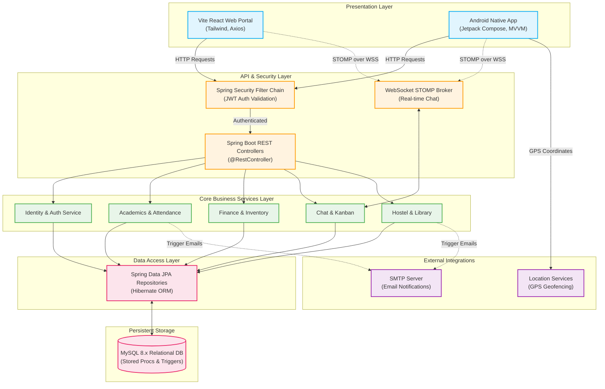
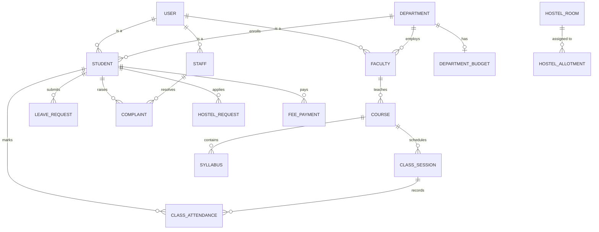
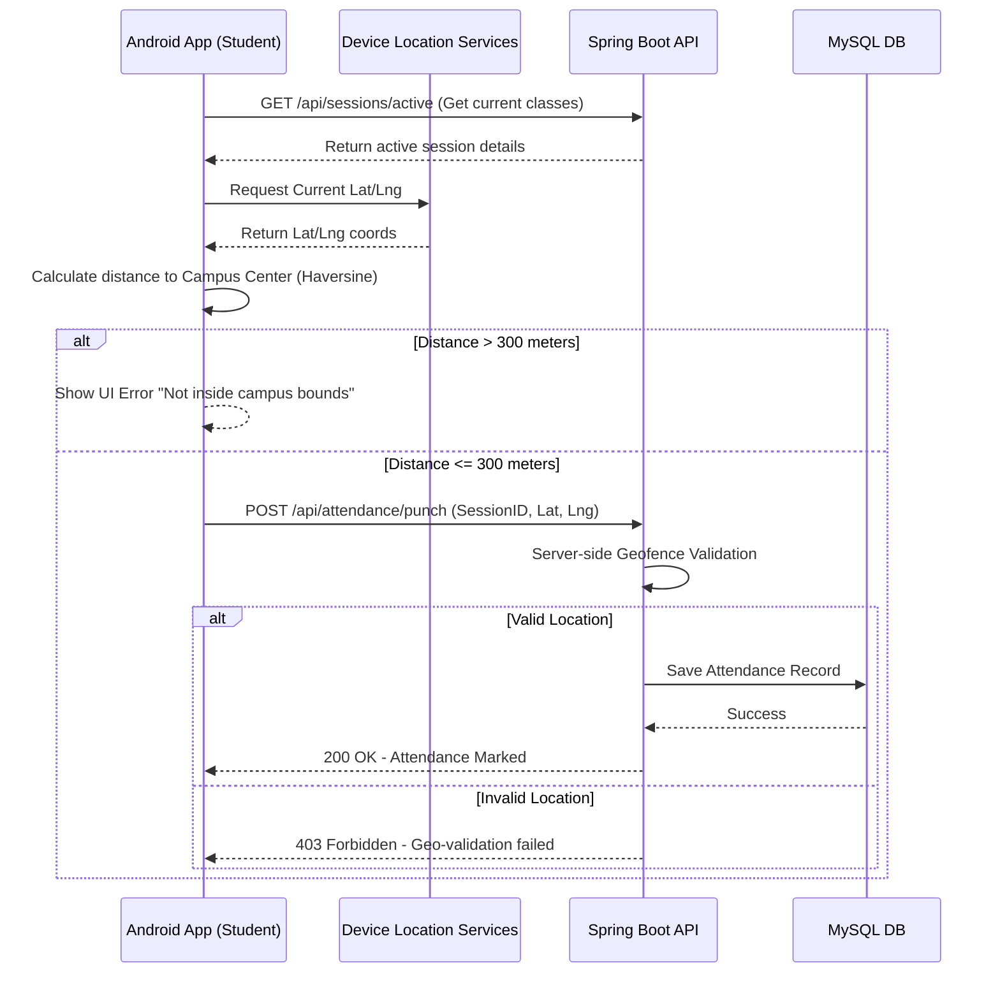

# Admin Office Management System

A comprehensive production-style full-stack application suite (Web + Mobile) simulated for institutional administrative office operations in colleges or IITs. 

It provides an end-to-end ERP solution featuring role-based access control, academic scheduling, student and faculty registries, real-time chat, hostel and transport management, finance and budget tracking, inventory management, library systems, official bulletin board notices, leave application workflows (with document upload), an issue ticket/complaint tracker, and extensive analytical reports (with PDF/CSV export).

---

## 🚀 Key Features & Modules

*   **User & Identity Management**: Role-based access control (Admin, Staff, Faculty, Student) with JWT authentication.
*   **Academics & Attendance**: Course and syllabus management, class sessions, academic calendar, and class attendance tracking (including mobile geofencing for in-campus verification).
*   **Communication & Collaboration**: 
    *   **Real-time Chat**: WebSocket-based messaging channels and direct messages.
    *   **Notices**: Official digital bulletin board.
    *   **Task Management**: Kanban-style task boards for staff and faculty.
*   **Campus Facilities**:
    *   **Hostel Management**: Room allocation, hostel requests, and capacity management.
    *   **Library Management**: Digital library catalog, book issues/returns, and library cards.
    *   **Transport Management**: Bus routes, stops, vehicle tracking, and trips.
*   **Finance & Administration**:
    *   **Finance**: Department budgets, expenses, student fee payments, and salary records.
    *   **Inventory**: Asset tracking and inventory allocation across departments.
    *   **HR Workflows**: Leave requests with multi-level approvals and email notifications.
    *   **Support Desk**: Issue ticket/complaint tracker with category stats.
*   **Analytics**: Comprehensive dashboards, activity logging, and PDF/CSV report generation.

---

## 💻 Technical Stack

*   **Backend System**: Java Spring Boot 3.2.5, Spring Security 6.x, Spring Data JPA, JWT Authentication (jjwt 0.11.5), Maven, WebSockets (STOMP), Spring Mail, Spring Boot Actuator, OpenPDF.
*   **Frontend Web Portal**: React.js (Vite), Tailwind CSS v3, Axios, React Router DOM, Lucide Icons, Recharts.
*   **Mobile Application**: Android Native (Jetpack Compose), MVVM + Clean Architecture, Retrofit, WebSockets, Location Services (Geofencing).
*   **Database**: MySQL 8.x.

---

## 🏗️ System Architecture & Design

### 1. High-Level System Architecture (C4 Model)
The platform follows a layered, decoupled architecture separating the presentation layers (Web & Mobile) from the core business logic and persistent storage.



### 2. Core Entity-Relationship (ER) Overview
The database schema is highly normalized. Below is a simplified view of the core domain entities and their relationships.



### 3. Workflow: Mobile Geofenced Attendance
A specialized workflow utilizing the mobile app to ensure students are physically present on campus before recording attendance.



---

## 📁 Folder Structure

```text
IIT/
├── android/            # Jetpack Compose native Android application module (Clean Arch)
│   ├── app/            # Source code, themes, layouts, viewmodels, and DI modules
│   └── build.gradle.kts# Android app gradle scripts
├── backend/            # Java Spring Boot backend project
│   ├── src/            # Java source files (Entities, Controllers, Services) and configs
│   └── pom.xml         # Maven project dependencies file
├── frontend/           # React.js Vite frontend web application
│   ├── src/            # Pages (Finance, Hostel, Library, etc.), Components, Context, Styles
│   └── package.json    # Frontend dependency mappings
├── sql/                # Database definition scripts
│   ├── schema.sql      # Tables, indexes, stored procedures, and triggers
│   ├── seed_data.sql   # BCrypt-hashed mock data seed file
│   └── finance_migration.sql # Additional migrations for finance module
├── postman/            # Postman integration collections
│   └── IIT_Admin_Office_System.postman_collection.json
└── README.md           # Project setup and user guide
```

---

## 🗄️ Database Setup

1.  Start your MySQL service.
2.  Open your preferred MySQL client (command line, WorkBench, DBeaver, etc.) and log in:
    ```bash
    mysql -u root -p
    ```
3.  Import the database schema and migrations:
    ```sql
    source sql/schema.sql;
    source sql/finance_migration.sql;
    ```
4.  Seed the initial dummy data:
    ```sql
    source sql/seed_data.sql;
    ```

*Note: The database name will be initialized as `iit_admin_db`. The seed data populates tables with default admin, staff, faculty, and student profiles.*

---

## ⚙️ Backend Configuration & Start

1.  Verify the database credentials in `backend/src/main/resources/application.properties`:
    ```properties
    spring.datasource.url=jdbc:mysql://localhost:3306/iit_admin_db?useSSL=false&serverTimezone=UTC&allowPublicKeyRetrieval=true
    spring.datasource.username=root
    spring.datasource.password=password
    ```
2.  Navigate to the `backend/` directory:
    ```bash
    cd backend
    ```
3.  Start the Spring Boot application using Maven:
    ```bash
    mvn clean spring-boot:run
    ```

The backend server will run at: **`http://localhost:8082`**.

---

## 🌐 Frontend Configuration & Start

1.  Navigate to the `frontend/` directory:
    ```bash
    cd frontend
    ```
2.  Install dependencies:
    ```bash
    npm install
    ```
3.  Run the Vite development server:
    ```bash
    npm run dev
    ```

The frontend application will be hosted at: **`http://localhost:5173`**.

---

## 📱 Mobile App (Android)

1. Open the `android` folder in **Android Studio**.
2. Sync Gradle files.
3. Update `BASE_URL` in network constants if you are running on a physical device (replace `localhost` with your machine's local IP address).
4. Run the app on an emulator or physical device.

---

## 👥 User Roles & Credentials

All seeded accounts share the default password: **`password`** (BCrypt-hashed).

| Role | Username | Email | Permission Scope |
| :--- | :--- | :--- | :--- |
| **ADMIN** | `admin` | `admin@iit.ac.in` | Full management access across all modules (Finance, Transport, Settings, etc.). |
| **STAFF** | `staff_rahul` | `rahul.staff@iit.ac.in` | Manage student registry, process leave requests, allocate hostels, assign/close complaints. |
| **FACULTY** | `prof_sharma` | `dsharma@cse.iit.ac.in` | Manage course syllabus, mark attendance, create notices, apply for leave, chat with students. |
| **STUDENT** | `stud_amit` | `amit.singh@iit.ac.in` | View timetable, mark mobile attendance, pay fees, apply for leave/hostel, raise complaints. |

---

## 🛠️ Stored Procedures & Triggers Included

*   **`GetDepartmentStudentCount()`**: Summarizes students count by academic department.
*   **`GetMonthlyLeaveStats()`**: Computes approval and rejection metrics per calendar month.
*   **`GetComplaintCategoryStats()`**: Grouping complaint tickets by operational category with resolution percentage.
*   **`GetStudentRegistrationOrder()`**: Demonstrates analytical window functions (`ROW_NUMBER()`) partitioning registration order inside departments.
*   **`after_notice_insert`**: Database trigger logging system activities on notice updates.
*   **`after_complaint_insert`**: Database trigger creating audit logs on ticket creations.

---

## 🧪 API Testing (Postman)

Import the file: `postman/IIT_Admin_Office_System.postman_collection.json` into Postman.
*   The collection includes tests that automatically capture the JWT token upon calling **User Login** and load it into global headers for all other requests.
*   Configure the postman environment variable `base_url` to point to `http://localhost:8082`.
